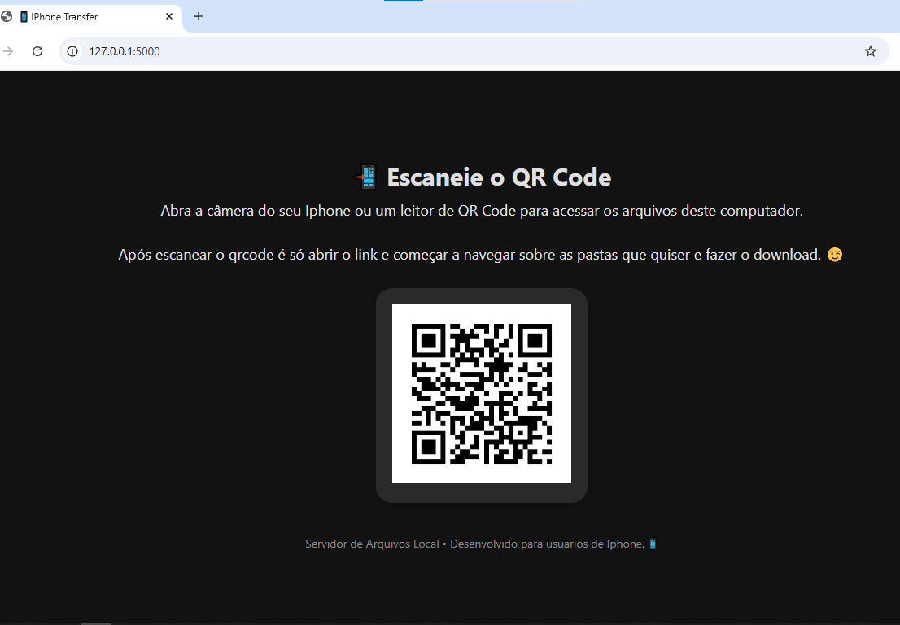

# 📲 iPhone Transfer

**Baixe agora o programa *iPhone Transfer*!**

📥 Download: <https://mrdurden-hub.github.io/Iphone-Transfer/>

🔐 A senha é: `iphone-transfer`

Este programa tem como objetivo **facilitar a transferência de arquivos entre seu PC e um iPhone**, de forma rápida, simples e sem precisar de cabos ou programas pesados.

---

## 🚀 Como Funciona?

O programa cria um **servidor local na sua rede Wi-Fi**, tornando os arquivos do seu computador acessíveis através de um **link gerado por um QR Code**.

Assim, você pode acessar fotos, vídeos, PDFs, músicas e qualquer outro arquivo diretamente do navegador do seu iPhone.

---

## 📦 Como Usar?

1. **Descompacte o arquivo ZIP**  
   🔐 A senha é: `iphone-transfer`

2. **Execute o programa (.exe)**  
   Dê dois cliques no arquivo. Automaticamente o navegador será aberto exibindo um **QR Code**.

3. **Escaneie o QR Code com o seu iPhone**  
   Basta apontar a câmera ou usar um app leitor de QR Code.  
   Você será redirecionado para uma página com acesso direto às pastas e arquivos do seu computador.

4. **Baixe seus arquivos direto no celular!**  
   Você verá os arquivos listados e poderá visualizar imagens e vídeos, ou clicar no ícone de download 📥 para salvar no seu dispositivo.

---

## 💡 Dica de Compatibilidade

Para a melhor experiência no iPhone, recomendamos usar o **Google Chrome** como navegador ao abrir o link do QR Code. Isso garante maior compatibilidade com arquivos e pastas.

---

## ✨ Simples, rápido e sem complicações!

Transferência de arquivos nunca foi tão fácil. Obrigado por usar o *iPhone Transfer*!  

---

## 📄 Licença

Este projeto está licenciado sob os termos da **Creative Commons Atribuição-NãoComercial 4.0 Internacional (CC BY-NC 4.0)**.  
Você pode usá-lo, modificá-lo e distribuí-lo livremente, **desde que não para fins comerciais** e com devida atribuição.

🔗 [Leia a licença completa](https://creativecommons.org/licenses/by-nc/4.0/)

### 📦 Versão PRO

A versão gratuita deste software é distribuída sob a Licença CC BY-NC 4.0.  
Para acessar recursos exclusivos e avançados, adquira a **versão PRO** (distribuição com direitos reservados).

➡️ Entre em contato para saber mais ou acompanhe o lançamento no nosso site oficial.
